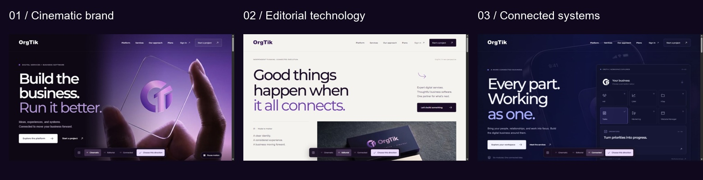

# OrgTik website

Three responsive frontend landing-page directions for OrgTik, built with React and Vite using the supplied brand guidelines and assets.



| Direction | Local route | Design |
| --- | --- | --- |
| Cinematic brand | `/cinematic` | Immersive imagery, dark plum surfaces, and confident typography |
| Editorial technology | `/editorial` | Light surfaces, generous spacing, and structured storytelling |
| Connected systems | `/connected` | Deep indigo and an interactive business-module explorer |

The comparison gallery is at `/`. Each direction includes an animated hero video placeholder, responsive navigation, a module explorer, plan selection, enquiry previews, and reduced-motion support.

## Run locally

Use a current supported Node.js release compatible with Vite, then run:

```sh
cd landing-directions
npm ci
npm run dev -- --host 127.0.0.1 --port 4173 --strictPort
```

Open [http://127.0.0.1:4173](http://127.0.0.1:4173).

## Validate and build

```sh
cd landing-directions
npm run format:check
npm run build
```

The static frontend is written to `landing-directions/dist/client`. A static host needs an SPA fallback to `index.html` for the three landing routes. Assets expect to be served from the domain root.

## Project contents

- [Frontend documentation](landing-directions/README.md)
- [Frontend project plan](orgtik-frontend-project-plan.md)
- [Website information architecture](orgtik-website-ia.md)
- [Brand guidelines](ORGTIK.pdf)
- [Design QA and verification](landing-directions/design-qa.md)
- [Third-party notices](landing-directions/THIRD-PARTY-NOTICES.md)
- `landing-directions/src/`: the three layouts and shared frontend components.
- `landing-directions/public/assets/`: original brand exports, video placeholders, posters, and source manifests.

## Scope

This repository contains the frontend design exploration. Enquiry, account, and plan interactions are labelled previews: they do not send messages, authenticate users, charge payments, or create subscriptions. There is no backend application. The remaining website follows after a direction is selected.

OrgTik artwork comes from the supplied brand PDF. Third-party font and library notices are retained; no new license grant is added for the brand materials.
